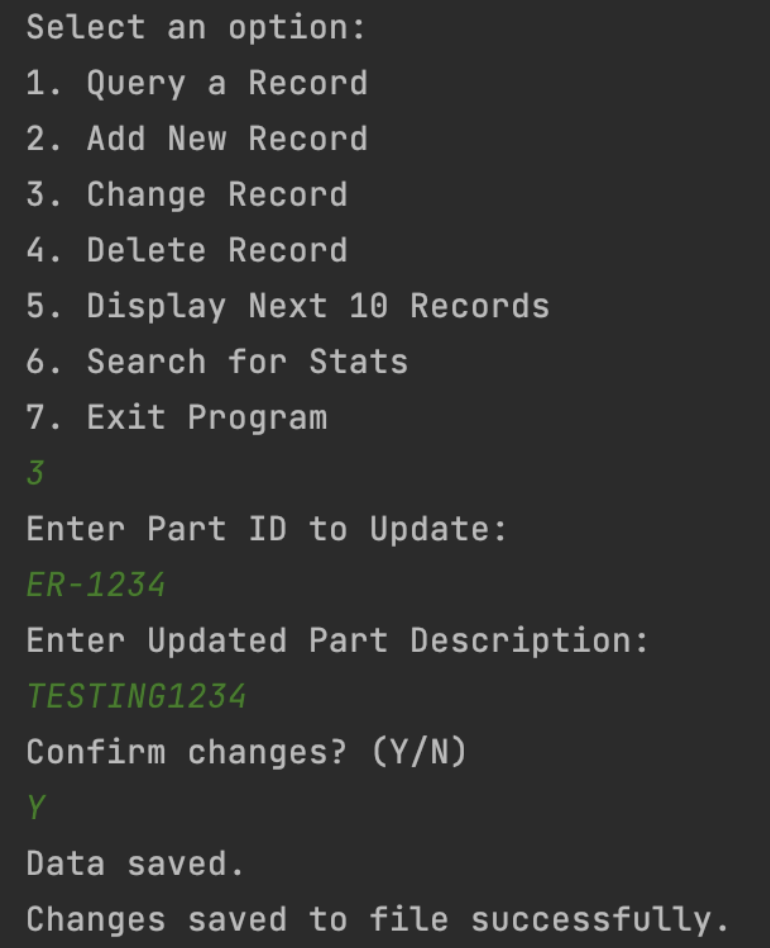

# B+ Tree Parts Catalog 
## 1. Project Overview 
This project implements a parts catalog system using a B+ Tree data structure in Java to manage and manipulate a dataset of part records. This is an alternative to a traditional database. The primary objective is to ensure efficient data operations as it maintains data integrity while adhering to the B+ Tree's properties. By leveraging the B+ Tree's data storage and retrieval efficiency, the project demonstrates how a database-like system can be constructed using alternative data structures like the B+ Tree and still ensure performance and scalability based in a single-user environment. 

## 2. Project Highlights 
- Custom **B+ Tree implementation** with balanced internal and leaf nodes, fast seach, insert, update and delete operations, sequential traversals, node splitting and merging, etc. 
- Supports all **CRUD** operations
- Tracks tree **statistics** on leaf splits, parent splits, leaf fusions, parent fusions, etc. 

## 3. Demo 

## 4. How to Use
- Open the project into IntelliJ and run Main.java
- Load the parts file when prompted 
- Use CLI commands to perform operations 

## 5. Technologies Utilized
- **Java**
- B+ Tree **Data Structure**
- **Object Oriented** Design
- **File I/O**
- **Command-Line Interface (CLI)**

## 6. Key Learnings 
- Understanding how databases achieve **indexing** as opposed to individual scanning
- Designing a **modular system** distinguishing **indexing** and **user interaction**
- Implementing a balanced tree with **node splits** and **fusions**

## 7. Ideas for Future Improvemnent 
- Add a graphical user interface (GUI)
- Build a REST API around B+ Tree storage engine
- Extend the system to handle several users 
